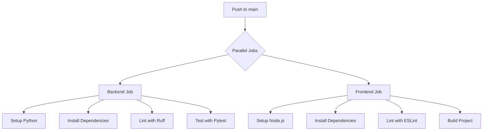

# CI/CD Workflow Plan

The workflow will be named `CI` and run on `push` to `main`. It will contain two main jobs: `backend` and `frontend`.

## Workflow Structure

## Proposed Steps

### Backend
1. Use `actions/setup-python`.
2. `pip install -r backend/requirements.txt` + `pytest` + `ruff`.
3. `ruff check backend`
4. `pytest backend`

### Frontend
1. Use `actions/setup-node`.
2. `npm install` inside `frontend` folder.
3. `npm run lint`
4. `npm run build`

Would you like to approve this structure or make changes?
